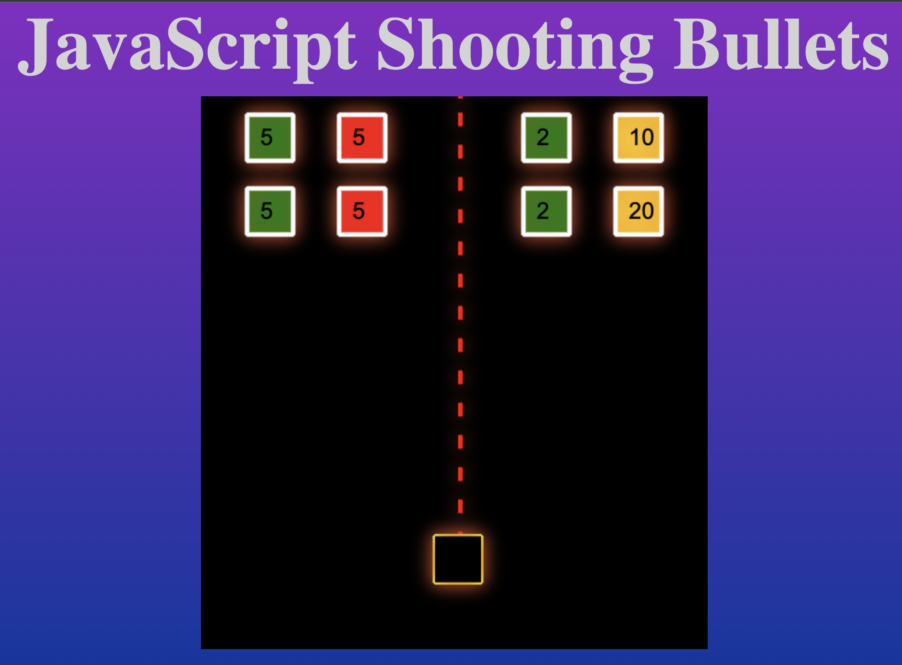

# Shooting Bullets in JavaScript - Game Dev

YouTube Link: https://youtu.be/i7FzA4NavDs

In this exciting video we are going to learn how to shoot bullets in a 2D game using JavaScript and a HTML canvas. We will code everything from scratch starting with a blank canvas. The bullet engine that we are going to build will be highly configurable that means you can change the speed, damage amount and even limit the number of bullets that are fired at a time.

If you enjoy this tutorial please subscribe, like and share on YouTube.

Try it here
https://codingwith-adam.github.io/shooting-bullets-game-dev/index.html
